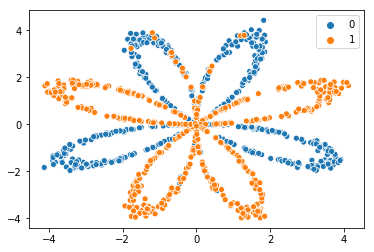
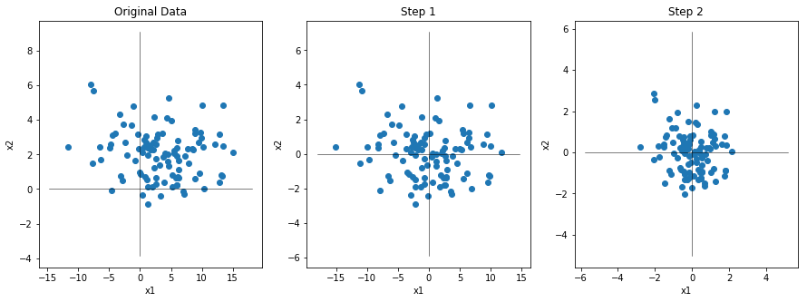
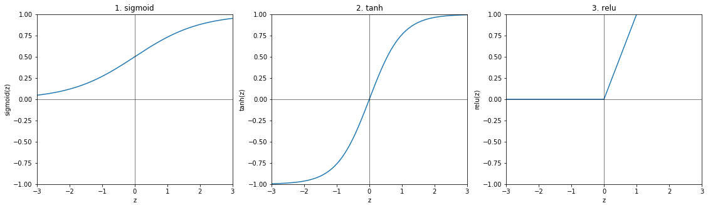
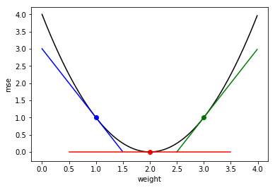
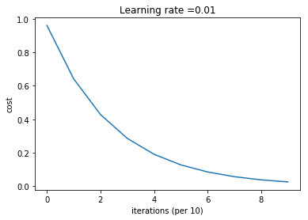
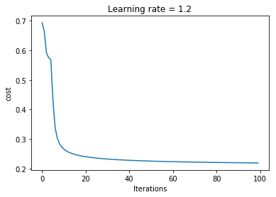
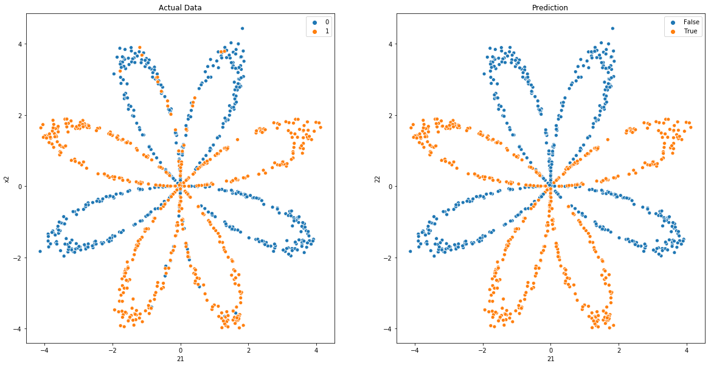
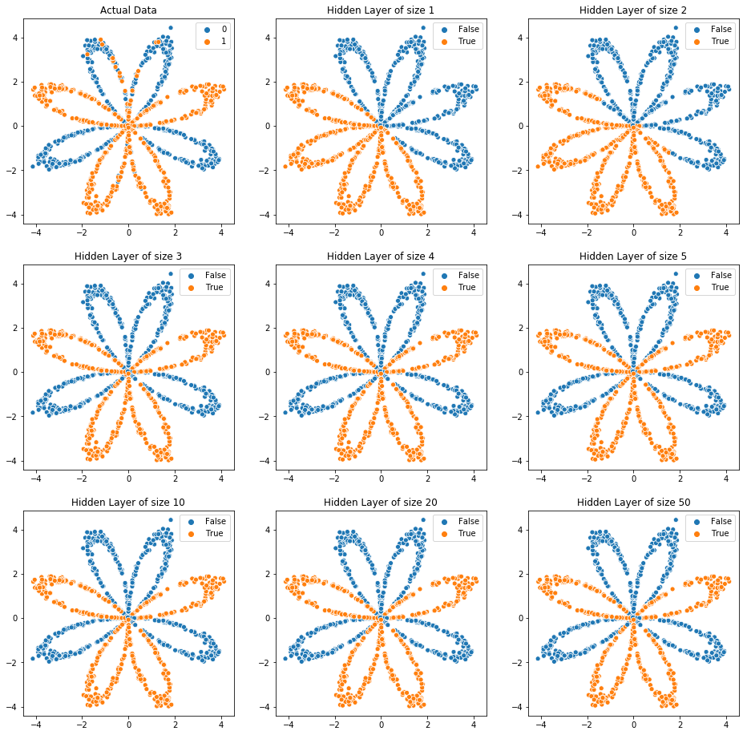

```python
import numpy as np
import pandas as pd
import networkx as nx
import matplotlib.pyplot as plt
import seaborn as sns
from sklearn import datasets
from sklearn import metrics
import time
import warnings
from IPython.display import Image

warnings.filterwarnings('ignore')
```

# 1. Basic Structure

### About layers

- Input layer: Each data of our train datas will be put into input layer. Thus, the number of features of train datas has to match with the number of nodes of input layer. We usually don't count the input layer as an official layer.
- Output layer: Output layer shows result of our model. 
- Hidden layers: All layers that are not input or output layers are called hidden layers.     

### Hidden layers

They are called hidden layers because, while the inputs and outputs correspond to visible things that happend in the world, and they can be stored as data, the values in the hidden layer aren't something we have data about, or anything we observe directly from the world. Each node in the hidden layer represents an aggregation of information from our input data, and each node adds to the model's abiliy to capture interactions. So the more nodes we have, the more interactions we can capture. In other words, they internally build up representations of the patterns in the data that are useful for making predictions. And they find increasingly complex patterns as we go through successive hidden layers of the network. In this way, neural networks partially replace the need for feature engineering, or manually creating better predictive features. Deep larning is also sometimes called representation learning, because subsequent layers build increasingly sophisticated representations of the raw data, until we ge to a stage where we can make predictions.

### The number of nodes and layers

The number of layers and the number of nodes in each layer have to be tested because the effective numbers of layers and nodes are different for each datasets.

# 2. Notations and Set Network Parameters

Let's suppose we have following datas


```python
def load_planar_dataset():
    np.random.seed(1)
    m = 1000 # number of examples
    N = int(m/2) # number of points per class
    D = 2 # dimensionality
    X = np.zeros((m,D)) # data matrix where each row is a single example
    Y = np.zeros((m,1), dtype='uint8') # labels vector (0 for red, 1 for blue)
    a = 4 # maximum ray of the flower

    for j in range(2):
        ix = range(N*j,N*(j+1))
        t = np.linspace(j*3.12,(j+1)*3.12,N) + np.random.randn(N)*0.2 # theta
        r = a*np.sin(4*t) + np.random.randn(N)*0.2 # radius
        X[ix] = np.c_[r*np.sin(t), r*np.cos(t)]
        Y[ix] = j
        
    X = X.T
    Y = Y.T

    return X, Y

```


```python
X, Y = load_planar_dataset()

```


```python
sns.scatterplot(X[0,:], X[1,:], hue = Y[0])
plt.show()

```





```python
print('Train data X shape:' + str(X.shape))
print('Train data Y shape:' + str(Y.shape))

```

    Train data X shape:(2, 1000)
    Train data Y shape:(1, 1000)


Let's consider we will use following neurl network structure and let's set network parameters corresponding to our network. 


```python
### Check network parameter ###
def check_network_parameter(X, Y, layer_dims):
    n_x = X.shape[0]
    n_y = Y.shape[0]
    assert(layer_dims[0])  == n_x
    assert(layer_dims[-1]) == n_y
    
    return layer_dims

```


```python
layer_dims = check_network_parameter(X, Y, [2,3,1])

```


```python
for i in range(len(layer_dims)):
        if i == 0:
            print('There are ' + str(layer_dims[i]) + ' nodes in input layer')
        elif i == len(layer_dims)-1:
            print('There are ' + str(layer_dims[i]) + ' nodes in output layer')
        else:
            print('There are ' + str(layer_dims[i]) + ' nodes in hidden layer ' + str(i))

```

    There are 2 nodes in input layer
    There are 3 nodes in hidden layer 1
    There are 1 nodes in output layer


### Number notation

- ^[ i ] : It indicates layer number.
    - Input layer will be noted by [0] 
    - Our first hidden layer will be noted by [1]
    - Output layer will be noted by [2]
- ^( i ) : It indicates i-th train data.
- _i : It indicates i-th node in each layer

### Weights and bias

There are weights and bias that we have to optimize later in each layer except for input layer.          
- First Hidden layer: There are weights and bias at first hidden layer. Since [ 1 ] indicates this hidden layer by above number notation, let's denote weights and bias corresponding to this hidden layer as $\ w^{[1]}, b^{[1]}.$
- Output layer: There are weights and bias at output layer. Since [ 2 ] indicates this output layer by above number notation, let's denote weights and bias corresponding to this output layer as $\ w^{[2]}, b^{[2]}.$ 
              
These weights indicate how strongly nodes effect later nodes that the line ends at.

### Vectorization


For i_th data, there are following calculation procedure:
- [ 1 ] :  
$ Let \:\: w^{[1]}_1 = \begin{bmatrix} w^{[1]}_{11} \\ w^{[1]}_{21} \end{bmatrix}, \: w^{[1]}_2 = \begin{bmatrix} w^{[1]}_{12} \\ w^{[1]}_{22} \end{bmatrix}, \: 
                                     w^{[1]}_3 = \begin{bmatrix} w^{[1]}_{13} \\ w^{[1]}_{23} \end{bmatrix}\\
       Then \:\: z^{[1](i)}_{1} = x^{(i)}_{1}w^{[1]}_{11} + x^{(i)}_{2}w^{[1]}_{21} + b^{[1]}_{1} \\
       \qquad\qquad\,  = \begin{bmatrix} w^{[1]}_{11} & w^{[1]}_{21}\end{bmatrix}\begin{bmatrix} x^{(i)}_{1} \\ x^{(i)}_{2} \end{bmatrix} + b^{[1]}_{1} \\
       \qquad\qquad\,  = w^{[1]T}_1X^{(i)} + b^{[1]}_{1} \qquad\qquad\qquad and \:\:\:\, a^{[1](i)}_{1} = activate(z^{[1](i)}_{1}) \\
           \qquad\: z^{[1](i)}_{2} = w^{[1]T}_{2}X^{(i)} + b^{[1]}_{2} \qquad\qquad\qquad\qquad\: a^{[1](i)}_{2} = activate(z^{[1](i)}_{2})\\
           \qquad\: z^{[1](i)}_{3} = w^{[1]T}_{3}X^{(i)} + b^{[1]}_{3} \qquad\qquad\qquad\qquad\: a^{[1](i)}_{3} = activate(z^{[1](i)}_{3})$
      
      
- [ 2 ] :         
$\ Let \:\: w^{[2]}_1 = \begin{bmatrix} w^{[2]}_{11} \\ w^{[2]}_{21} \\ w^{[2]}_{31} \end{bmatrix} \\
        Then \:\: z^{[2](i)}_{1} = a^{[1](i)}_{1}w^{[2]}_{11} + a^{[1](i)}_{2}w^{[2]}_{21} + a^{[1](i)}_{3}w^{[2]}_{31} + b^{[2]}_{1} \\
       \qquad\qquad\,  = \begin{bmatrix} w^{[2]}_{11} & w^{[2]}_{21} & w^{[2]}_{31} \end{bmatrix}\begin{bmatrix} a^{[1](i)}_{1} \\ a^{[1](i)}_{2} \\ a^{[3](i)}_{3} \end{bmatrix} + b^{[2]}_{1} \\
       \qquad\qquad\,  = w^{[2]T}_1a^{[1](i)} + b^{[2]}_{1} \qquad\qquad\qquad and \:\:\:\, a^{[2](i)}_{1} = activate(z^{[2](i)}_{1}) $

Let's vectorize above procedure

- [ 1 ] :                      
$\ Let \:\:\: W^{[1]} = \begin{bmatrix} --w^{[1]T}_{1}-- \\ --w^{[1]T}_{2}-- \\ --w^{[1]T}_{3}-- \end{bmatrix}\,(shape = [3,2]), \:\:\: b^{[1]} = \begin{bmatrix} b^{[1]}_{1} \\ b^{[1]}_{2} \\ b^{[1]}_{3} \end{bmatrix}\,(shape = [3,1])\\          
\:\: Then \:\:\: z^{[1](i)} = \begin{bmatrix} z^{[1](i)}_{1} \\ z^{[1](i)}_{2} \\ z^{[1](i)}_{3} \end{bmatrix}
                         = \begin{bmatrix} w^{[1]T}_{1}X^{(i)} + b^{[1]}_{1} \\ w^{[1]T}_{2}X^{(i)} + b^{[1]}_{2} \\ w^{[1]T}_{3}X^{(i)} + b^{[1]}_{3} \end{bmatrix} = W^{[1]}X^{(i)} + b^{[1]} \quad and \:\:\: a^{[1](i)} = \begin{bmatrix} a^{[1](i)}_{1} \\ a^{[1](i)}_{2} \\ a^{[1](i)}_{3} \end{bmatrix} = \begin{bmatrix} activate(z^{[1](i)}_{1}) \\ activate(z^{[1](i)}_{2}) \\ activate(z^{[1](i)}_{3}) \end{bmatrix} = activate(z^{[1](i)}) $
                         
- [ 2 ] :                                  
$\ \\
Likewise, \:\:\: z^{[2](i)} = W^{[2]}X^{(i)} + b^{[2]} \quad and \:\:\: a^{[2](i)} = activate(z^{[2](i)}) $

Since there are m data points, we have to do above procedure m times if we don't vectorize. So, let's vectorize all 1, 2, ... , $\ m_{th}$ procedure. 

- [ 1 ] :                
$Let \:\: X = \begin{bmatrix} X^{(1)} & X^{(2)} & \dots & X^{(m)}\end{bmatrix}\,(shape = [2, m]), \:\:\: and\:\: we\:\: have\:\: W^{[1]} = \begin{bmatrix} --w^{[1]T}_{1}-- \\ --w^{[1]T}_{2}-- \\ --w^{[1]T}_{3}-- \end{bmatrix}\,(shape = [3,2]), \:\:\: b^{[1]} = \begin{bmatrix} b^{[1]}_{1} \\ b^{[1]}_{2} \\ b^{[1]}_{3} \end{bmatrix}\,(shape = [3,1]) \\ 
\qquad \\
Z^{[1]} = \begin{bmatrix} z^{[1](1)}_{1} & z^{[1](2)}_{1} & \dots & z^{[1](m)}_{1} \\
                                        z^{[1](1)}_{2} & z^{[1](2)}_{2} & \dots & z^{[1](m)}_{2} \\
                                        z^{[1](1)}_{3} & z^{[1](2)}_{3} & \dots & z^{[1](m)}_{3} \end{bmatrix} $
                
$\quad\quad\quad\: = \begin{bmatrix} --w^{[1]T}_{1}-- \\ --w^{[1]T}_{2}-- \\ --w^{[1]T}_{3}-- \end{bmatrix}\begin{bmatrix} X^{(1)} & X^{(2)} & \dots & X^{(m)}\end{bmatrix} + \begin{bmatrix} b^{[1]}_{1} \\ b^{[1]}_{2} \\ b^{[1]}_{3} \end{bmatrix} $
                
$\quad\quad\quad\: = W^{[1]}X + b^{[1]} : [3,2][2,m] + [3,1] = [3,m]$
                   
$\quad\:\: A^{[1]} = \begin{bmatrix} a^{[1](1)}_{1} & a^{[1](2)}_{1} & \dots & a^{[1](m)}_{1} \\
                                              a^{[1](1)}_{2} & a^{[1](2)}_{2} & \dots & a^{[1](m)}_{2} \\
                                              a^{[1](1)}_{3} & a^{[1](2)}_{3} & \dots & a^{[1](m)}_{3} \end{bmatrix} $
                                        
$\qquad\quad\: = activate(Z^{[1]})$
                 
                 
- [ 2 ] :                     
$\ we\:\: have\:\: A^{[1]} = \begin{bmatrix} a^{[1](1)}_{1} & a^{[1](2)}_{1} & \dots & a^{[1](m)}_{1} \\
                                             a^{[1](1)}_{2} & a^{[1](2)}_{2} & \dots & a^{[1](m)}_{2} \\
                                             a^{[1](1)}_{3} & a^{[1](2)}_{3} & \dots & a^{[1](m)}_{3} \end{bmatrix}, \:\:\: W^{[2]} = \begin{bmatrix} --w^{[2]T}_{1}-- \end{bmatrix}\,(shape = [1,3]), \:\:\: b^{[2]} = \begin{bmatrix} b^{[2]}_{1}  \end{bmatrix}\,(shape = [1,1]) \\ 
\qquad \\
Z^{[2]} = \begin{bmatrix} z^{[2](1)}_{1} & z^{[2](2)}_{1} & \dots & z^{[2](m)}_{1} \end{bmatrix} $ 

$\quad\quad\quad\:\, = \begin{bmatrix} --w^{[2]T}_{1}-- \end{bmatrix}\begin{bmatrix} X^{(1)} & X^{(2)} & \dots & X^{(m)}\end{bmatrix} + \begin{bmatrix} b^{[2]}_{1} \end{bmatrix} $

$\quad\quad\quad\:\, = W^{[2]}A^{[1]} + b^{[2]} : [1,3][3,m] + [3,1] = [1,m]$

$\quad\:\:\,\, A^{[2]} = \begin{bmatrix} a^{[2](1)}_{1} & a^{[2](2)}_{1} & \dots & a^{[2](m)}_{1} \end{bmatrix} $
                                        
$\qquad\quad\:\: = activate(Z^{[2]})$
                                       

To summarize,           
                    
$\ Z^{[1]} = W^{[1]}A^{[0]} + b^{[1]} \:\: ( A^{[0]} = X ) \\
  \: A^{[1]} \:= activate(Z^{[1]}) $
                
$\ Z^{[2]} = W^{[2]}A^{[1]} + b^{[2]} \\
  \: A^{[2]} \:= activate(Z^{[2]}) \\
\quad\:\:\:\: = \hat{Y} $

# 3. Normalizing inputs

When training a neural network, one of the techniques that will spped up our training is to normalize our inputs. Let's consider following data and each step of normailzing.


```python
# original data
np.random.seed(42)
x1 = np.random.normal(loc = 4, scale = 6  , size = 100)
x2 = np.random.normal(loc = 2, scale = 1.5, size = 100)

# step 1
x1_step1 = x1 - x1.mean()
x2_step1 = x2 - x2.mean()

# step 2
x1_step2 = x1_step1/np.std(x1)
x2_step2 = x2_step1/np.std(x2)
```


```python
plt.figure(figsize=(15,5))

# original data
plt.subplot(1,3,1)
plt.scatter(x1, x2)
plt.plot([x1.min()-3,x1.max()+3],[0,0], lw = 0.5, c = 'black')
plt.plot([0,0],[x2.min()-3,x2.max()+3], lw = 0.5, c = 'black')
plt.xlabel('x1')
plt.ylabel('x2')
plt.title('Original Data')

# step 1
plt.subplot(1,3,2)
plt.scatter(x1_step1, x2_step1)
plt.plot([x1_step1.min()-3,x1_step1.max()+3],[0,0], lw = 0.5, c = 'black')
plt.plot([0,0],[x2_step1.min()-3,x2_step1.max()+3], lw = 0.5, c = 'black')
plt.xlabel('x1')
plt.ylabel('x2')
plt.title('Step 1')

# step 2
plt.subplot(1,3,3)
plt.scatter(x1_step2, x2_step2)
plt.plot([x1_step2.min()-3,x1_step2.max()+3],[0,0], lw = 0.5, c = 'black')
plt.plot([0,0],[x2_step2.min()-3,x2_step2.max()+3], lw = 0.5, c = 'black')
plt.xlabel('x1')
plt.ylabel('x2')
plt.title('Step 2')

plt.show()
```





- step 1 : subtract each mean. So, x1, x2 will have same mean = 0
- step 2 : divide each standard deviation. So, x1, x2 will have same standard dievation = 1


If we use unnormalized input features, it is more likely that our cost function will be very elongated function. It means we have to use very small learning rate. Whereas if we normalize the features, then our cost function will be more symmetric. It means wherever we strart, gradient descent can pretty much go straight to the minimum. So we can take much larger steps with gradient descent.

But in our toy data, our features came in on similar scales. So I will not do normalizing

# 4. Forward Propagation ( Calculate $ \hat{Y} $ )

### Initialize Weights and bias

We have to initalize w and b that we will optimize later. When initialize, it is important to initialize the weights randomly. For logistic regression, it was okay to initialize the weights to zero. But for a neural network of initialize the weights to parameters to all zero and then applied gradient descent, it won't work. This is because, if we initialize all weights to 0, then every value of node in same layer will be same, which means they become completely identical even after every step of optimization. Thus, no matter how long we train our neural network, every node in same layer are still computing exactly the same function. And it means it is like neural network that have only one node in each layer.   
            
The solution is to initialzie our parameters randomly. For W, we usually generate a gaussian random variable and then multiply this by very small number, such as 0.01. So we initialize it to very small random values. If w is too large, it causes our s-shaped activation function to be saturated, thus slowing down learning. If we don't have any s-shaped activation functions througout our neural network, this is less of an issue.
                       
And then for b, it turns out that b does not have the symmetry breaking problem. Since already w is initialized randomly, each node in same hidden layer are computing different functions even though all b are equal to 0. So, it is okay to initalize b to just zeros. 


```python
### Initializing paramters with zero ###
def initialize_parameters_zero(layer_dims):
    np.random.seed(42)
    parameters = {}
    L = len(layer_dims)
    
    for l in range(1,L):
        parameters['W' + str(l)] = np.zeros((layer_dims[l], layer_dims[l-1]))
        parameters['b' + str(l)] = np.zeros((layer_dims[l], 1)) 
    
    return parameters   

### Initializing parameters with random number ###
def initialize_parameters_random(layer_dims):
    np.random.seed(42)
    parameters = {}
    L = len(layer_dims)
    
    for l in range(1,L):
        parameters['W' + str(l)] = np.random.randn(layer_dims[l], layer_dims[l-1]) * 0.01
        parameters['b' + str(l)] = np.zeros((layer_dims[l], 1)) 
    
    return parameters   

```


```python
parameters = initialize_parameters_zero(layer_dims)
print('<Zero initialization>')
for k,v in parameters.items():
    print(k + ' has shape ', v.shape)
    print(v)
```

    <Zero initialization>
    W1 has shape  (3, 2)
    [[0. 0.]
     [0. 0.]
     [0. 0.]]
    b1 has shape  (3, 1)
    [[0.]
     [0.]
     [0.]]
    W2 has shape  (1, 3)
    [[0. 0. 0.]]
    b2 has shape  (1, 1)
    [[0.]]


```python
parameters = initialize_parameters_random(layer_dims)
print('<Random initialization>')
for k,v in parameters.items():
    print(k + ' has shape ', v.shape)
    print(v)
```

    <Random initialization>
    W1 has shape  (3, 2)
    [[ 0.00496714 -0.00138264]
     [ 0.00647689  0.0152303 ]
     [-0.00234153 -0.00234137]]
    b1 has shape  (3, 1)
    [[0.]
     [0.]
     [0.]]
    W2 has shape  (1, 3)
    [[ 0.01579213  0.00767435 -0.00469474]]
    b2 has shape  (1, 1)
    [[0.]]


### Activate function

After initializing parameters, we can calculate $ \hat{Y} $ that lie in output layer by matrix multiplication.

$\ Z^{[1]} = W^{[1]}A^{[0]} + b^{[1]} \:\: ( A^{[0]} = X ) \\
  \: A^{[1]} \:= activate(Z^{[1]}) $
                
$\ Z^{[2]} = W^{[2]}A^{[1]} + b^{[2]} \\
  \: A^{[2]} \:= activate(Z^{[2]}) \\
\quad\:\:\:\: = \hat{Y} $
            
The remaining thing  is to choose which actiate function to use.

There are many activate functions that is non-linear. If we do not use non-linear activate functions, then our model is just computing $\hat{Y}$ as a linear function of our input features.

$\ Z^{[1]} = W^{[1]}X + b^{[1]} $            
$\ A^{[1]} = Z^{[1]} $               
$\ Z^{[2]} = W^{[2]}A^{[1]} + b^{[2]} $               
$\:\hat{Y} = A^{[2]} = Z^{[2]} \\
             \qquad\quad\:\, = W^{[2]}A^{[1]} + b^{[2]} \\
             \qquad\quad\:\, = W^{[2]}(W^{[1]}X + b^{[1]}) + b^{[2]} \\ 
             \qquad\quad\:\, = W^{[2]}W^{[1]}X + W^{[2]}b^{[1]} + b^{[2]} \\
             \qquad\quad\:\, = W'X + b' \:\:(where\:\: W' = W^{[2]}W^{[1]},\: b' = W^{[2]}b^{[1]} + b^{[2]})$
           

So, if we use a linear activate function, then no matter how many layers our neural network has, all its doing is just computing a linear function of the input. Thus, if there is non-linearity feature in output data, we can't catch this non-liniearity with linear activate functions. This is why we use non-linear activate functions. Non-linear activate functions allow our model to capture non-linearities in our data. The following 3 functions are non-linear activate functions many used.


```python
z = np.arange(-3,3, 0.01)

sigmoid = 1/(1 + np.exp(-z))
tanh = (np.exp(z) - np.exp(-z))/(np.exp(z) + np.exp(-z))
relu = z*(z>0)

activate_function = {'sigmoid':sigmoid,
                     'tanh' : tanh,
                     'relu' : relu}

plt.figure(figsize=[19,5])

i = 1
for k,v in activate_function.items():
    plt.subplot(1,3,i)
    plt.plot(z,v)
    plt.plot([-3,3],[0,0], c = 'black', lw = 0.5)
    plt.plot([0,0],[-1,1], c = 'black' , lw = 0.5)
    plt.ylim([-1, 1])
    plt.xlim([-3, 3])
    plt.xlabel('z')
    plt.ylabel(k + '(z)')
    plt.title(str(i) + '. ' + k)
    i += 1
    
    
```





$1. sigmoid( z ) = \frac{1}{1 + e^{-(z)}}$   
                 
$2. tanh( z ) = \frac{e^{z} - e^{-z}}{e^{z} + e^{-z}}$       
                   
$3. relu( z ) = \max(0, z)$

Sigmoid, tanh, relu functions are commonly used. For a long time, s-shaped function called tanh or sigmoid was a popular activation function. Among them, tanh function almost always works better than sigmoid function, because if we use tanh function which has value between -1 and +1, the mean of this function is 0, while sigmoid function has mean 0.5. It kind of has the effect of centering our data so that the mean of our data is closer to 0 rather than 0.5. And this actually makes learning for the next layer a little bit easier. One exception is output layer. In the case that y_hat have to be probability that is in between 0 and 1, we have to use sigmoid function as activate function. But, downside of s-shaped function like sigmoid and tanh is that when z is very large or very small, the slope of the function ends up being close to 0. So this can slow down gradient descent. 

                
So one other choice is that is very popular is what's called the rectify linear unit(relu). The advantage of the Relu is that our neur network will learn much faster than when using the tanh or the sigmoid funcion. So, Relu is increasingly the default choice of activate function. 


```python
### Activate function ###
# sigmoid 
def sigmoid(z):
    s = 1 / (1 + np.exp(-z))
    return s

# tanh 
def tanh(z):
    t = (np.exp(z) - np.exp(-z))/(np.exp(z) + np.exp(-z))
    return t

# relu
def relu(z):
    return np.maximum(0, z)
```

### Calculate $\hat{Y}$

Let's calculate $\hat{Y}$ by above matrix multiplication. Since our problem is classification, we have to use sigmoid activation function at output layer.


```python
### Forward propagation ###
# Let's calculate Y_hat
def forward_propagation(X, parameters, hidden_activation, output_activation):
    if not hidden_activation in ['relu', 'sigmoid','tanh','None']:
        raise ValueError('hidden_ativation should be relu, sigmoid, or tanh')
    if not output_activation in ['sigmoid', 'softmax','None']:
        raise ValueError('output_ativation should be sigmoid or None')
    
    if hidden_activation == 'relu':
        hidden_activation_f = relu
    elif hidden_activation == 'sigmoid':
        hidden_activation_f = sigmoid
    else:
        hidden_activation_f = tanh
 
    if output_activation == 'sigmoid':
        output_activation_f = sigmoid
    else:
        output_activation_f = lambda z : z
    
    L = len(parameters) //2
    cache = {}
    A = X
    
    for l in range(1, L):
        Z = np.dot(parameters['W' + str(l)], A) + parameters['b' + str(l)]
        A = hidden_activation_f(Z)
        cache['Z' + str(l)] = Z
        cache['A' + str(l)] = A
    
    Z = np.dot(parameters['W' + str(L)], A) + parameters['b' + str(L)]
    A = output_activation_f(Z)
    cache['ZL'] = Z
    cache['AL'] = A
    
    assert(A.shape == (1, X.shape[1]))
    
    return cache

```


```python
cache = forward_propagation(X, parameters, hidden_activation = 'sigmoid', output_activation='sigmoid')

```


```python
for k,v in cache.items():
    print(k + ' has shape : ', v.shape)
```

    Z1 has shape :  (3, 1000)
    A1 has shape :  (3, 1000)
    ZL has shape :  (1, 1000)
    AL has shape :  (1, 1000)


### Loss function and Cost function

To train the parameters w and b of our model, we need to define a loss function and a cost function. We want to optimize our w and b to make $\hat{Y}$ become very similar to true Y value. So, we have to define above criteria mathematically. For this, we can use loss function to measure how well our algorithm is doing.

Loss function is for a single training example. The following functions are commonly used loss functions.
- regression problem:                   
$\ L(\hat{Y}^{(i)}, Y^{(i)}) = (\hat{Y}^{(i)} -\: Y^{(i)})^{2}\\ $
                
- classification problem:            
$\ L(\hat{Y}^{(i)}, Y^{(i)}) = -[Y^{(i)}\,log\hat{Y}^{(i)} + (1-Y^{(i)})\,log(1-\hat{Y}^{(i)})] $
    - If $\ Y^{(i)} = 1 $: $\ L(\hat{Y}^{(i)}, Y^{(i)}) = - log\hat{Y}^{(i)} $ <- We want $\ log\hat{Y}^{(i)} $ to be large, which means $\hat{Y}^{(i)} $ have to be large. 
    - If $\ Y^{(i)} = 0 $: $\ L(\hat{Y}^{(i)}, Y^{(i)}) = - log(1-\hat{Y}^{(i)}) $ <- We want $\ log(1-\hat{Y}^{(i)}) $ to be large, which means $\hat{Y}^{(i)} $ have to be small.

While loss function measures how well our model is doing on each single example, Cost function measures how well our model is doing on entire training set. That is, we use cost functions to aggregate all losses from each single training example into a single measure of the model's predictive performance.           

$\ J(w, b) = \frac{1}{m} \sum_{i=1}^m L(\hat{Y}^{(i)}, Y^{(i)}) $


```python
def compute_cost(Y_h, Y, output_activation):
    if output_activation == 'sigmoid':
        loss = -(np.multiply(Y, np.log(Y_h)) + np.multiply(1-Y, np.log(1-Y_h)))
    else:
        loss = np.multiply(Y_h - Y, y_h - Y)
    
    cost = np.sum(loss)/Y.shape[1]
    
    return cost

```


```python
AL = cache['AL']
print('cost = ' + str(compute_cost(AL, Y, output_activation = 'sigmoid')))
```

    cost = 0.6931656498323333


# 5. Back Propagation (Optimize w, b)

### Gradient descent

The lower value of cost function means a better model. So our goal is to find the weights and bias giving the lowest value for the cost function. We do this with many algorithms. One of these algorithms is a gradient descent which is similar to find lowest ground of the mountain. We might feel the groud to see how it slopes, and take a small step downhill. We repeat this process until it is uphil in every direction. This is roughly how does the gradient descent work.


```python
w = np.arange(0., 4., 0.01)
mse = np.square(w - 2)

w1 = np.arange(0., 1.5, 0.01)
line1 = -2 * w1 + 3
w2 = np.arange(2.5, 4, 0.01)
line2 = 2 * w2 -5
w3 = np.arange(0.5, 3.5, 0.01)
line3 = 0 * w3

plt.plot(w, mse, 'black')

plt.plot(w1, line1, 'b')
plt.scatter(1,1, c = 'b')

plt.plot(w2, line2, 'g')
plt.scatter(3,1, c = 'g')

plt.plot(w3, line3, 'r')
plt.scatter(2, 0, c = 'r')

plt.xlabel('weight')
plt.ylabel('mse')
plt.show()

```





Let's think about we are given weight value which is not equal to 2, and we want to update weight to 2.     
- if given weight w = 1, the slope at w = 1 is -2 < 0. So w have to move to plus direction(bigger number) to arrive at w = 2.
- if given weight w = 3, the slope at w = 3 is  2 > 0. So w have to move to minus direction(smaller number) to arrive at w = 2.
              
So, we can add or subtract slope from current weight value to move to w = 2. But if the step is too big, it might lead us far astray. So instead of directly subtracting or adding the slope, we multiply the slope by a small number, called the learning rate, and we change the weights by the product of tht multiplication. Learning rate are frequently around $\alpha$ = 0.01       
                     
w = w - $\alpha \frac{\partial J}{\partial w}$   
             
Let's update given weight 1.($\alpha$ = 0.01)


```python
def get_slope(w):
    return 2*(w-2)
```


```python
def update_w(w, n_update = 100, learning_rate = 0.01):
    cost = []
    for i in range(n_update):
        w = w - learning_rate * get_slope(w)
        if i%10 == 0:
            cost.append( (w - 2)*(w - 2) )
            print(str(i + 10) + 'th updated: w=', w)
            
    plt.plot(cost)
    plt.ylabel('cost')
    plt.xlabel('iterations (per 10)')
    plt.title('Learning rate =' + str(0.01))  
    
    return w, cost

```


```python
w, cost = update_w(1, 100, 0.01)

```

    10th updated: w= 1.02
    20th updated: w= 1.199268649250204
    30th updated: w= 1.3457441876800074
    40th updated: w= 1.4654253670052115
    50th updated: w= 1.5632136041280682
    60th updated: w= 1.6431137135146254
    70th updated: w= 1.7083979201617217
    80th updated: w= 1.7617398701322915
    90th updated: w= 1.8053241269195996
    100th updated: w= 1.8409356379489137





In order to Gradient Descent to work, we must choose the learning rate wisely. The learning rate $\alpha$  determines how rapidly we update the parameters. If the learning rate is too large we may "overshoot" the optimal value. Similarly, if it is too small we will need too many iterations to converge to the best values. That's why it is crucial to use a well-tuned learning rate.

### Get gradient by Chain Rule

To do gradient optimization, we need to get gradient of the cost function with respect to w and b. We can get gradient of each parameter by using chain rule.


Let's calculate gradient.             


```python
def activation_backward(A, hidden_activation):
    if hidden_activation == 'relu':
        return A > 0
    elif hidden_activation == 'sigmoid':
        return np.multiply(A, 1-A)
    elif hidden_activation == 'tanh':
        return 1 - np.multiply(A, A)
    elif hidden_activation == None:
        return 1
```


```python
def backward_propagation(X, Y, parameters, cache, hidden_activation, output_activation):
    m = X.shape[1]
    grads = {}
    AL = cache['AL']
    L = len(parameters)//2
    cache['A0'] = X
    
    for i in reversed(range(L)):
        l = i+1
        if l == L:         
            if output_activation == 'sigmoid':
                dAL = - (np.divide(Y, AL) - np.divide(1 - Y, 1 - AL))
                dZ  = AL - Y
            else:
                dAL = 2(AL - Y)
                dZ  = 2(AL - Y) 
        
            grads['dW'+str(l)] = 1/m * np.dot(dZ, cache['A'+str(l-1)].T)
            grads['db'+str(l)] = 1/m * np.sum(dZ, axis = 1, keepdims = True)
        else:
            grads['dA'+str(l)] = np.dot(parameters['W'+str(l+1)].T, dZ)
            dZ = grads['dA'+str(l)] * activation_backward(cache['A'+str(l)], hidden_activation)
            grads['dW'+str(l)] = 1/m * np.dot(dZ, cache['A' + str(l - 1)].T)
            grads['db'+str(l)] = 1/m * np.sum(dZ, axis = 1, keepdims = True)
        
    return grads
```


```python
grads = backward_propagation(X, Y, parameters, cache, hidden_activation = 'sigmoid', output_activation = 'sigmoid')
```


```python
print(grads.keys())
```

    dict_keys(['dW2', 'db2', 'dA1', 'dW1', 'db1'])


### Gradient checking


```python
# take w1 b1 .... wL bL and reshape into a big vector theta
# take dw1 db1 ... dwL dbL and reshape into a big vector theta

# J(theta)  = J(theta1 theta2 ... )

# for each i
#     dtheta_appre[i] = J(1, 2, .... theta i + 입실론, .. ) - J(1, 2, ... theta i -입실론, ... ) / 2입실론 =비슷 dtheta[i] = dj/dtheta[i]
    
    
# dtheta approx =? d theta check: \\dtheta approx - dtheta\\_2 / \\dtheta_approx\\_2 + \\dtheta\\_2 =비슷 10^-7 : great
# 10^-5 may be bug, check
# 10^-3 check

# 입실론 = 10^-7


# don't use in training only to debug
# if algorithm fails grad check, look at components to try identify bug
# remember regularization
# doesn't work with dropout
# run at random initialziation:
    
    
```

### Update parameters

By using above gradients, we can update our parameters by following gradient descent rule:              
$ \theta = \theta - \alpha \frac{\partial J }{ \partial \theta }$ where $\alpha$ is the learning rate and $\theta$ represents a parameter.


```python
def update_parameters(parameters, grads, learning_rate):
    L = len(parameters) // 2
    
    for l in range(L):
        parameters['W'+str(l+1)] = parameters['W'+str(l+1)] - learning_rate * grads['dW'+str(l+1)]
        parameters['b'+str(l+1)] = parameters['b'+str(l+1)] - learning_rate * grads['db'+str(l+1)]

    return parameters

```


```python
print('(Before update) W1:' + str(parameters['W1']))
print('(Before update) b1:' + str(parameters['b1']))
print('(Before update) W2:' + str(parameters['W2']))
print('(Before update) b2:' + str(parameters['b2']))

```

    (Before update) W1:[[ 0.00496714 -0.00138264]
     [ 0.00647689  0.0152303 ]
     [-0.00234153 -0.00234137]]
    (Before update) b1:[[0.]
     [0.]
     [0.]]
    (Before update) W2:[[ 0.01579213  0.00767435 -0.00469474]]
    (Before update) b2:[[0.]]


```python
parameters = update_parameters(parameters, grads, learning_rate = 1.2)

print('(After update) W1:' + str(parameters['W1']))
print('(After update) b1:' + str(parameters['b1']))
print('(After update) W2:' + str(parameters['W2']))
print('(After update) b2:' + str(parameters['b2']))

```

    (After update) W1:[[ 0.00475308 -0.00243503]
     [ 0.00637273  0.01471942]
     [-0.00227788 -0.00202853]]
    (After update) b1:[[-1.11167949e-05]
     [-5.38797857e-06]
     [ 3.30443744e-06]]
    (After update) W2:[[ 0.01440902  0.00516403 -0.00591489]]
    (After update) b2:[[-0.00281582]]


# 6. Integrate All Procedure

### Parameters and Hyperparameters

To be effective in developing our deep neural networks, we need to organize hyperparameters as well as parameters.
- Parameters : W and b that we will optimize with our models.
- Hyperparameters : Parameters are that we need to tell our learning algorithm and so these are parameters that control the ultimate parameters W and b.
    - The number of hidden layers
    - The number of hidden nodes 
    - Activation function 
    - Learning rate ($ \,\alpha\, $) : It determine how our parameters evolve.
    - The number of iterations : How many time we will do optimization procedure with our training datas.
    - Momentum term
    - Mini batch size
    - Regularization parameters
           
It is very difficult to know exactly what is the best value of the hyper parameters because best hocies may depend on the amount of data we have, the number of input features, wheter we are training on GPUs or CPUs and many other things. So we just have to try out many different values and evaluate them. 


```python
def nn_model(X, Y, layer_dims, initialization_method = 'random', hidden_activation = 'sigmoid', output_activation = 'None', num_iterations = 10000, learning_rate = 0.01, print_cost = False, plot_cost = False):
    np.random.seed(42)
    cost_list = []
    
    # Check network parameters
    layer_dims = check_network_parameter(X, Y, layer_dims)
    
    # Initialize parameters
    if not initialization_method in ['zero', 'random']:
        raise ValueError('initialization_method should be zero or random')
    if initialization_method == 'zero':
        parameters = initialize_parameters_zero(layer_dims)
    else:
        parameters = initialize_parameters_random(layer_dims)
    
    # Iteration for optimizing our parameters
    for i in range(num_iterations):
        # Forward propagation
        cache = forward_propagation(X, parameters, hidden_activation, output_activation)
        AL = cache['AL']
        
        # Compute cost
        cost = compute_cost(Y_h = AL, Y = Y, output_activation = output_activation)
        
        # Backwoard propagation
        grads = backward_propagation(X, Y, parameters, cache, hidden_activation, output_activation)
        
        # Gradient descent parameter update
        parameters = update_parameters(parameters, grads, learning_rate)
        
        # print the cost every 1000 iterations
        if i % 100 == 0:
            cost_list.append(cost)
        if (i % 1000 == 0) & print_cost:
            print('Cost after %i iteration : %f' %(i + 1000, cost))
            
    if plot_cost:
        plt.plot(cost_list)
        plt.xlabel('Iterations')
        plt.ylabel('cost')
        plt.title('Learning rate = ' + str(learning_rate))

    return parameters
```


```python
parameters = nn_model(X, Y, [2,3,1], initialization_method = 'random', hidden_activation = 'sigmoid', output_activation = 'sigmoid', num_iterations = 10000, learning_rate = 1.2, print_cost = True, plot_cost = True)
    
    
```

    Cost after 1000 iteration : 0.693166
    Cost after 2000 iteration : 0.265756
    Cost after 3000 iteration : 0.240068
    Cost after 4000 iteration : 0.232200
    Cost after 5000 iteration : 0.227943
    Cost after 6000 iteration : 0.225191
    Cost after 7000 iteration : 0.223244
    Cost after 8000 iteration : 0.221787
    Cost after 9000 iteration : 0.220650
    Cost after 10000 iteration : 0.219735





### Predictions and Accuracy

Output value of our model is the probability that the input data belongs to 1. So, let's assign our output value by following rule:          
$y_{prediction} = \mathbb 1 \text{{activation > 0.5}} = \begin{cases}
      1 & \text{if}\ activation > 0.5 \\
      0 & \text{otherwise}
    \end{cases}$  


```python
def predict(parameters, X, hidden_activation, output_activation):
    cache = forward_propagation(X, parameters, hidden_activation, output_activation)
    AL = cache['AL']
    predictions = AL > 0.5
    
    return predictions
```


```python
predictions = predict(parameters, X, hidden_activation = 'sigmoid', output_activation = 'sigmoid')
```


```python
# Plot our prediction
plt.figure(figsize = (20,10))

plt.subplot(1,2,1)
sns.scatterplot(X[0,:], X[1,:], hue = Y[0])
plt.xlabel('21')
plt.ylabel('x2')
plt.title('Actual Data')

plt.subplot(1,2,2)
sns.scatterplot(X[0,:], X[1,:], hue = predictions[0])
plt.xlabel('21')
plt.ylabel('22')
plt.title('Prediction')

plt.show()
```





```python
# Confusion matrix of our prediction

confusion_matrix = metrics.confusion_matrix(Y[0], predictions[0])
confusion_matrix
```


    array([[465,  35],
           [ 41, 459]])


```python
# Accuracy of our prediction
def get_accuracy(confusion_matrix):
    TP = confusion_matrix[0][0]
    FN = confusion_matrix[0][1]
    FP = confusion_matrix[1][0]
    TN = confusion_matrix[1][1]

    accuracy = (TP + TN)/(TP + TN + FP + FN)

    precision = TP / (TP + FP)
    recall = TP / (TP + TN)
    F1_score = 2*(precision * recall) / (precision + recall) 

    return accuracy, F1_score
```


```python
accuracy, F1_score = get_accuracy(confusion_matrix)

print('Accuracy : ' + str(accuracy))
print('F1 Score : ' + str(F1_score))
```

    Accuracy : 0.924
    F1 Score : 0.6503496503496503


### Tuning number of nodes in hidden layer

Let's compare results of models that have difference in number of nodes in hidden layer.


```python
hidden_layer_sizes = [1,2,3,4,5,10,20,50]

plt.figure(figsize = (16,16))

plt.subplot(3,3,1)
sns.scatterplot(X[0,:], X[1,:], hue = Y[0])
plt.title('Actual Data')

for i, n_h in enumerate(hidden_layer_sizes):
    tic = time.time()
    parameters = nn_model(X, Y, [2,n_h,1], initialization_method = 'random', hidden_activation = 'sigmoid', output_activation = 'sigmoid', num_iterations = 10000, learning_rate = 1.2, print_cost = False, plot_cost = False)
    predictions = predict(parameters, X, hidden_activation = 'sigmoid', output_activation = 'sigmoid')
    toc = time.time()
    
    confusion_matrix = metrics.confusion_matrix(Y[0], predictions[0])
    accuracy, F1_score = get_accuracy(confusion_matrix)
    print('{} hidden nodes'.format(n_h))
    print('Accuracy : {}%'.format(round(accuracy * 100, 2)))
    print('F1 Score : {}%'.format(round(F1_score, 3)))
    print('Time : ' + str(round(1000*(toc-tic),2)) + 'ms')
    print('-------------------------------------')
    
    plt.subplot(3,3,i+2)
    sns.scatterplot(X[0,:], X[1,:], hue = predictions[0])
    plt.title('Hidden Layer of size %d' % n_h)
    
```

    1 hidden nodes
    Accuracy : 69.7%
    F1 Score : 0.585%
    Time : 1436.9ms
    -------------------------------------
    2 hidden nodes
    Accuracy : 66.1%
    F1 Score : 0.567%
    Time : 1690.87ms
    -------------------------------------
    3 hidden nodes
    Accuracy : 92.4%
    F1 Score : 0.65%
    Time : 1669.84ms
    -------------------------------------
    4 hidden nodes
    Accuracy : 92.2%
    F1 Score : 0.65%
    Time : 1856.73ms
    -------------------------------------
    5 hidden nodes
    Accuracy : 92.0%
    F1 Score : 0.648%
    Time : 2108.75ms
    -------------------------------------
    10 hidden nodes
    Accuracy : 93.0%
    F1 Score : 0.653%
    Time : 3602.52ms
    -------------------------------------
    20 hidden nodes
    Accuracy : 92.7%
    F1 Score : 0.652%
    Time : 5297.66ms
    -------------------------------------
    50 hidden nodes
    Accuracy : 92.8%
    F1 Score : 0.653%
    Time : 9327.69ms
    -------------------------------------





The models that have 4 nodes and 50 nodes show highest accuracy : 91.6% and 92.7%. The difference in time spent optimizing models is very large( 4 nodes: 1827ms vs. 50 nodes: 8951ms), the difference in accuracy between the two models is very small( 4 nodes: 91.6% vs. 50 nodes: 92.7%). Thus, the best hidden layer size seems to be around n_h = 4.
